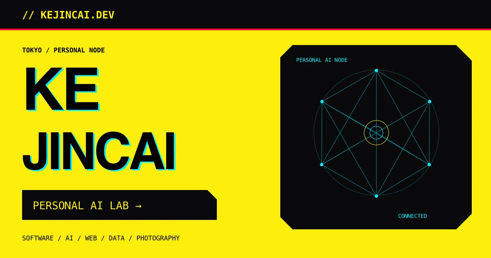
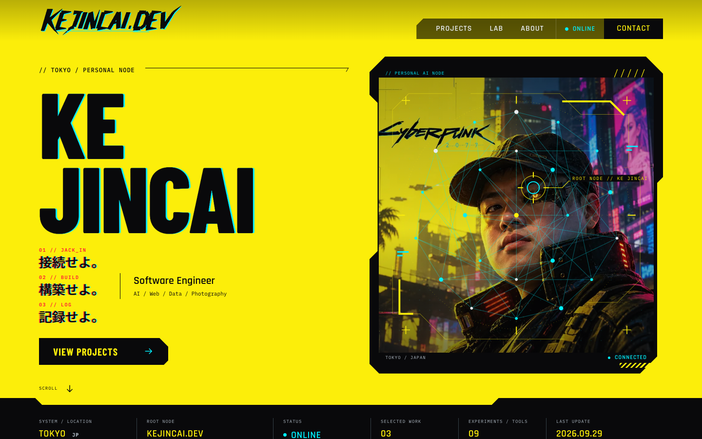
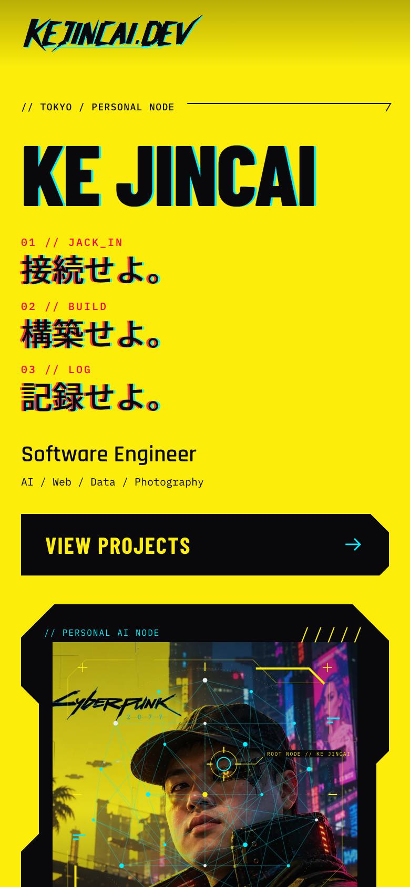
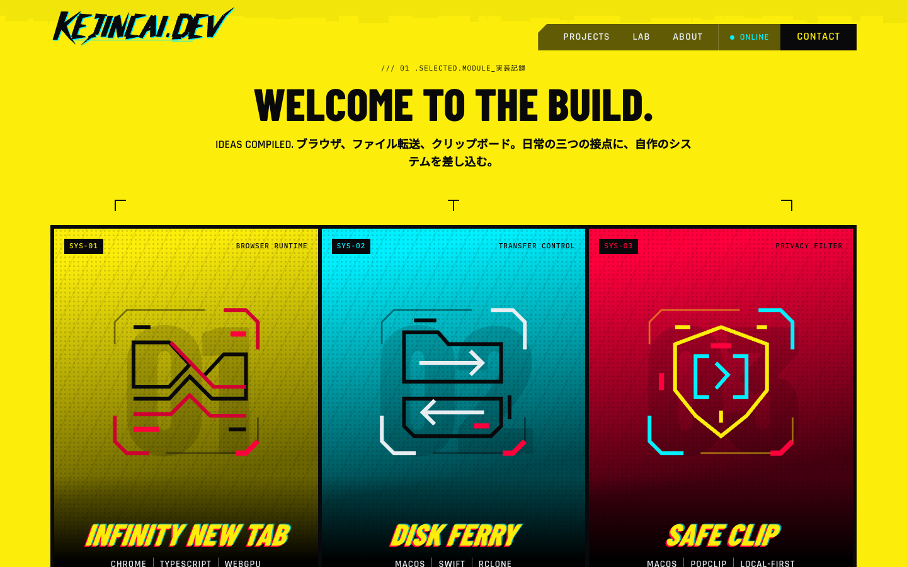

<div align="center">



# KEJINCAI.DEV

**A personal AI node, running in Tokyo.**

接続せよ。構築せよ。記録せよ。  
Jack in. Build. Log.

[](https://github.com/kekincai/kejincai.dev/actions/workflows/ci.yml)
[](https://astro.build)
[](https://www.typescriptlang.org)
[](LICENSE)

[Website](https://kejincai.dev) · [Design spec](SPEC.md) · [Content guide](docs/CONTENT.md) · [Deployment](docs/DEPLOYMENT.md) · [Contributing](CONTRIBUTING.md)

</div>

---

## The idea

A home for software projects, AI experiments, language study and digital memories. Each independent project is a node; the root site connects them. Smaller tools and unfinished ideas live in the lab.

**CYBERPUNK 2077 inspired**, laid out after the official cyberpunk.net page: a transparent header with a translucent nav plate, signal-yellow bands with skyline edges, colour-lit project posters, a news-style node board, condensed industrial typography, cyan signals and red markers. Interface graphics and the KEJINCAI.DEV brush lettering are original CSS and SVG. The only third-party mark is the Cyberpunk 2077 wordmark inside the owner's own cyber portrait, kept at the owner's request.

这是一个个人开发、AI 实验与学习记录的统一入口。采用鲜明的黄色与黑色、切角面板和日英混排，连接独立项目与尚在探索中的想法。

## Preview

Actual browser captures of the implementation, not design mockups.

[Project dossier](docs/images/projects.png) · [Mobile project posters](docs/images/projects-mobile.png) · [Lab](docs/images/lab.png) · [About](docs/images/about.png)



<details>
<summary>Mobile preview · 390px</summary>
<br />

</details>

<details>
<summary>Selected software posters</summary>
<br />

</details>

## Selected work

| Group      | Projects                                                                             |
| ---------- | ------------------------------------------------------------------------------------ |
| 精选项目   | Infinity New Tab, Disk Ferry, Safe Clip                                              |
| 有趣的实验 | Bookmark Cover Flow, PatternMart, TaskPaper MCP, dedup, Racket TODO, NetSpeedMonitor |
| 小工具     | 印象导出器, Base R Snake, Podcasts Unfollow                                          |

## Connected worlds

| Node                           | Focus                         | Destination                                        |
| ------------------------------ | ----------------------------- | -------------------------------------------------- |
| **青空しおり / AOZORA SHIORI** | Language & literature         | [aozora.kejincai.dev](https://aozora.kejincai.dev) |
| **PAUL.LOG**                   | AI, code & notes              | [blog.kejincai.dev](https://blog.kejincai.dev)     |
| **FDE RADAR**                  | AI & engineering intelligence | [fde.kejincai.dev](https://fde.kejincai.dev)       |

The root site introduces these projects without duplicating their content.

## What's included

- **Home** — three selected software projects and three independent site connections.
- **Projects** — Infinity New Tab, Disk Ferry and Safe Clip, plus the three independent websites.
- **Lab** — a compact list of six experiments and three small tools.
- **About** — interests and a concise personal introduction.
- **404** — a disconnected node, with a route back home.
- **RSS + sitemap** — generated at build time.
- **Responsive layouts** — phone navigation, single-column cards and compact lab rows.
- **Accessible motion** — reduced motion pauses the node network and removes page animations.

Featured: [Infinity New Tab](https://github.com/kekincai/infinity-newtab-extension), [Disk Ferry](https://github.com/kekincai/DiskFerry), and [Safe Clip](https://github.com/kekincai/safe-clip-popclip). Categories follow the owner’s selection; descriptions follow the public READMEs. No invented releases, activity feed or photography is included.

## Run locally

Requires **Node.js 22.12+**; CI uses Node.js 24.

```sh
git clone https://github.com/kekincai/kejincai.dev.git
cd kejincai.dev
npm ci
npm run dev
```

Open **http://localhost:4321**.

| Command                | Purpose                             |
| ---------------------- | ----------------------------------- |
| `npm run dev`          | Start the development server        |
| `npm run check`        | Validate Astro and TypeScript       |
| `npm run build`        | Generate the static site in `dist/` |
| `npm run preview`      | Serve the production build locally  |
| `npm run deploy`       | Build and deploy to Cloudflare      |
| `npm run format`       | Format source and documentation     |
| `npm run format:check` | Check formatting in CI              |

Mobile Lighthouse for the redesigned local build: **97 performance / 100 accessibility / 100 best practices / 100 SEO**. [Verification details](docs/VERIFICATION.md).

## Built with

**Astro 7 · TypeScript · Tailwind CSS 4**

Static HTML first. A small amount of vanilla TypeScript handles navigation and pointer response. Astro's client router provides quiet 200ms transitions. No React runtime, analytics or external font service is required.

Fonts are hosted with the site: Inter, IBM Plex Mono and Noto Sans JP. Japanese fonts are subset from the current source content before development and production builds.

```text
src/
├── components/       Header, hero, node network, cards and lab rows
├── data/             Identity, independent sites and curated project groups
├── layouts/          Shared metadata and page shell
├── pages/            Home, projects, lab, about, 404 and RSS
└── styles/           Design tokens and responsive rules
public/               Favicon, social image and static-asset headers
docs/                 Design references, previews and publishing guides
```

## Publish

**Production: [kejincai.dev](https://kejincai.dev)** · Cloudflare Workers static assets.

Run `npm run deploy` to build and publish with the versioned custom-domain route. The canonical domain is `https://kejincai.dev`.

See [Deployment](docs/DEPLOYMENT.md) for both paths. GitHub CI checks formatting, types and the production build; it does not deploy the domain automatically.

## Roadmap

- [x] Home, Projects, Lab, About and 404
- [x] Responsive navigation and content layouts
- [x] Curated projects, compact project lists, RSS and SEO
- [x] Reduced motion and self-hosted fonts
- [ ] Photography with original images and responsive AVIF/WebP
- [ ] Build-time aggregation of verified RSS / JSON feeds
- [x] Cloudflare deployment and custom domain
- [ ] Field performance verification

## License

Code is available under the [MIT License](LICENSE). The site identity and any future personal photographs are not a generic asset library; replace them when adapting the project.

---

<div align="center">

`TOKYO NODE / KEEP BUILDING`  
**EOF _**

</div>
